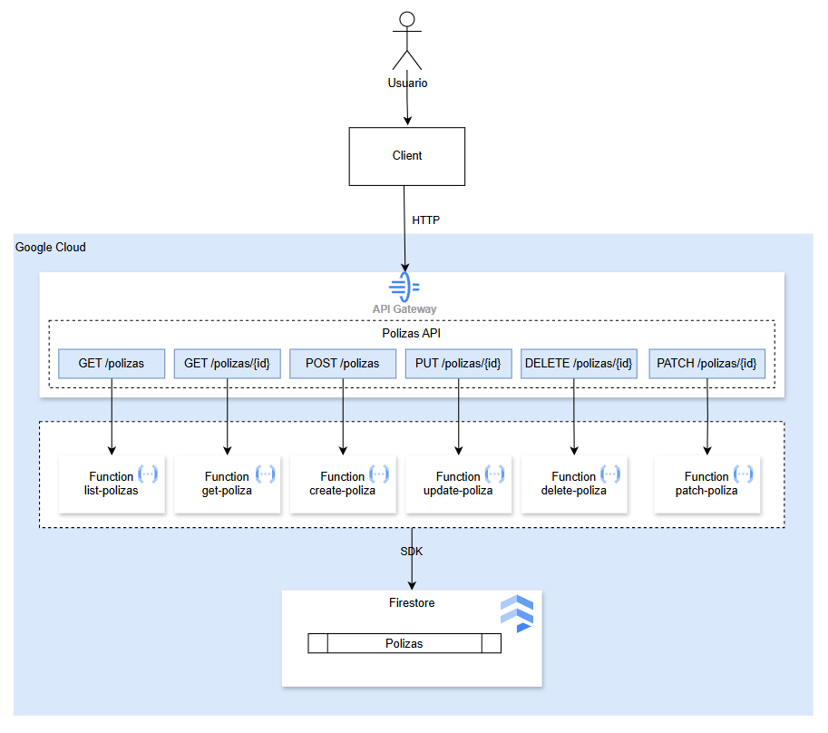

# MOD7-LAB1: API Pólizas en GCP — API Gateway + Cloud Functions + Firestore

**Instructor:** Miguel Leyva  

---

## 1. Objetivo y Alcance

### Objetivo

Desplegar una **API REST CRUD completa** para gestionar pólizas de seguros en Google Cloud Platform, utilizando:

- **API Gateway** como punto de entrada único de la API.
- **Cloud Functions 2nd gen con Python** como backend serverless por operación.
- **Firestore en modo Native** como base de datos NoSQL.
- **gcloud CLI** para provisionamiento y configuración.
- **curl** para pruebas funcionales desde terminal.

La mejora principal respecto al laboratorio anterior es que ya no se probarán múltiples URLs de Cloud Functions directamente. En esta versión se implementa un **API Gateway centralizado** para exponer una sola URL base:

```text
https://<gateway-host>/polizas
https://<gateway-host>/polizas/{polizaId}
```

### Alcance

Al finalizar el laboratorio, el alumno habrá implementado:

- Una convención de nombres con **sufijo único por participante**.
- Una colección Firestore exclusiva por participante: `polizas-{USER_SUFFIX}`.
- Seis Cloud Functions independientes:
  - `create_poliza` para `POST /polizas`
  - `list_polizas` para `GET /polizas`
  - `get_poliza` para `GET /polizas/{polizaId}`
  - `update_poliza` para `PUT /polizas/{polizaId}`
  - `patch_poliza` para `PATCH /polizas/{polizaId}`
  - `delete_poliza` para `DELETE /polizas/{polizaId}`
- Un **API Gateway por participante** con una única URL pública.
- Un archivo OpenAPI mínimo generado por terminal para enrutar cada endpoint hacia su Cloud Function correspondiente.
- Pruebas CRUD completas mediante `curl` usando la URL del API Gateway.
- Validaciones desde la consola web de GCP.
- Limpieza de recursos para evitar costos innecesarios.

---

## 2. Arquitectura del Laboratorio

### Arquitectura TO-BE con API Gateway



---

## 3. Prerrequisitos y Consideraciones

### Prerrequisitos

| Elemento | Detalle |
|---|---|
| Proyecto GCP | Proyecto compartido con facturación activa |
| Terminal | Cloud Shell recomendado |
| Región sugerida | `us-east1` |
| Firestore location | `nam5` |
| Python runtime | `python311` |

---

## 4. Laboratorio Guiado

> Todo el laboratorio se ejecuta desde la terminal.  
> Se recomienda usar **Google Cloud Shell**.

---

## Fase 1. Configuración inicial

### Paso 1.1 — Configurar proyecto GCP

```bash
# Reemplaza con el ID real del proyecto compartido
PROJECT_ID="tu-proyecto-compartido-id"
gcloud config set project $PROJECT_ID
```

### Paso 1.2 — Definir variables del laboratorio

> Cambia `USER_SUFFIX` por el sufijo asignado por el instructor.

```bash
# Modificacion tu Suffix con tus iniciales
USER_SUFFIX="cambiar-tu-iniciales"
REGION="us-east1"
FIRESTORE_LOCATION="nam5"

# Colección Firestore por participante
COLLECTION="polizas-${USER_SUFFIX}"

# Cloud Functions por participante
FUNC_CREATE="${USER_SUFFIX}-create-poliza"
FUNC_LIST="${USER_SUFFIX}-list-polizas"
FUNC_GET="${USER_SUFFIX}-get-poliza"
FUNC_UPDATE="${USER_SUFFIX}-update-poliza"
FUNC_PATCH="${USER_SUFFIX}-patch-poliza"
FUNC_DELETE="${USER_SUFFIX}-delete-poliza"

# API Gateway por participante
API_ID="api-polizas-${USER_SUFFIX}"
GATEWAY_ID="gw-polizas-${USER_SUFFIX}"
API_CONFIG_ID="cfg-polizas-${USER_SUFFIX}-$(date +%Y%m%d%H%M%S)"

# Nombre lógico del servicio API Gateway
API_TITLE="API Polizas ${USER_SUFFIX}"

echo "============================================"
echo "Proyecto      : $PROJECT_ID"
echo "Sufijo        : $USER_SUFFIX"
echo "Región        : $REGION"
echo "Colección     : $COLLECTION"
echo "API ID        : $API_ID"
echo "Gateway ID    : $GATEWAY_ID"
echo "API Config ID : $API_CONFIG_ID"
echo "============================================"
```

---

## Fase 2. Habilitar APIs y Firestore

### Paso 2.1 — Habilitar APIs requeridas

> Este paso solo necesita ejecutarse una vez por proyecto, pero es seguro ejecutarlo más de una vez.

```bash
gcloud services enable \
  cloudfunctions.googleapis.com \
  cloudbuild.googleapis.com \
  run.googleapis.com \
  artifactregistry.googleapis.com \
  firestore.googleapis.com \
  apigateway.googleapis.com \
  servicemanagement.googleapis.com \
  servicecontrol.googleapis.com

echo "✅ APIs habilitadas correctamente"
```

### Paso 2.2 — Crear base Firestore si no existe

```bash
gcloud firestore databases create \
  --location=$FIRESTORE_LOCATION \
  --type=firestore-native 2>/dev/null && \
  echo "✅ Base de datos Firestore creada" || \
  echo "ℹ️ Base de datos Firestore ya existe o no requiere creación"
```

---

## Fase 3. Crear código de las Cloud Functions

### Paso 3.1 — Crear directorio de trabajo

```bash
mkdir -p ~/crud-polizas-gcf-apigw
cd ~/crud-polizas-gcf-apigw
```

### Paso 3.2 — Crear dependencias

```bash
cat > requirements.txt << 'EOF'
functions-framework==3.*
google-cloud-firestore==2.*
EOF
```

### Paso 3.3 — Crear `main.py`

> En esta versión, las funciones que operan por ID leen el identificador desde la ruta administrada por API Gateway: `/polizas/{polizaId}`.

```bash
cat > main.py << 'PYEOF'
import functions_framework
from google.cloud import firestore
import json
import uuid
from datetime import datetime, timezone
import os

COLLECTION = os.environ.get("COLLECTION_NAME", "polizas")
db = firestore.Client()

CAMPOS_REQUERIDOS = [
    "numero_poliza", "placa", "propietario", "marca",
    "anio", "tipo_cobertura", "prima_mensual"
]

CAMPOS_ACTUALIZABLES = [
    "numero_poliza", "placa", "propietario", "marca",
    "anio", "tipo_cobertura", "prima_mensual", "estado"
]

COBERTURAS_VALIDAS = ["BASICA", "COMPLETA", "PREMIUM"]
ESTADOS_VALIDOS = ["ACTIVA", "SUSPENDIDA", "CANCELADA", "VENCIDA"]


def json_response(data, status_code=200):
    return (
        json.dumps(data, ensure_ascii=False, default=str),
        status_code,
        {"Content-Type": "application/json; charset=utf-8"}
    )


def get_poliza_id_from_request(request):
    """
    API Gateway reenvía la ruta completa hacia la Cloud Function.
    Para /polizas/{polizaId}, extraemos el último segmento de la ruta.
    También se mantiene compatibilidad con query param ?polizaId=.
    """
    poliza_id = request.args.get("polizaId")
    if poliza_id:
        return poliza_id

    path = request.path or ""
    parts = [p for p in path.split("/") if p]
    if len(parts) >= 2 and parts[0] == "polizas":
        return parts[1]
    if len(parts) >= 1:
        return parts[-1]
    return None


@functions_framework.http
def create_poliza(request):
    if request.method != "POST":
        return json_response({"error": "Metodo no permitido. Use POST"}, 405)

    body = request.get_json(silent=True)
    if not body:
        return json_response({"error": "Body vacio o JSON invalido"}, 400)

    faltantes = [c for c in CAMPOS_REQUERIDOS if c not in body]
    if faltantes:
        return json_response({"error": f"Campos requeridos faltantes: {faltantes}"}, 400)

    if body["tipo_cobertura"] not in COBERTURAS_VALIDAS:
        return json_response({"error": f"tipo_cobertura debe ser uno de: {COBERTURAS_VALIDAS}"}, 400)

    estado = body.get("estado", "ACTIVA")
    if estado not in ESTADOS_VALIDOS:
        return json_response({"error": f"estado debe ser uno de: {ESTADOS_VALIDOS}"}, 400)

    poliza_id = str(uuid.uuid4())
    now = datetime.now(timezone.utc).isoformat()

    poliza = {
        "id": poliza_id,
        "numero_poliza": body["numero_poliza"],
        "placa": body["placa"],
        "propietario": body["propietario"],
        "marca": body["marca"],
        "anio": body["anio"],
        "tipo_cobertura": body["tipo_cobertura"],
        "prima_mensual": body["prima_mensual"],
        "estado": estado,
        "creado_en": now,
        "actualizado_en": now
    }

    db.collection(COLLECTION).document(poliza_id).set(poliza)
    return json_response({"message": "Poliza creada exitosamente", "poliza": poliza}, 201)


@functions_framework.http
def list_polizas(request):
    if request.method != "GET":
        return json_response({"error": "Metodo no permitido. Use GET"}, 405)

    try:
        docs = db.collection(COLLECTION).order_by(
            "creado_en", direction=firestore.Query.DESCENDING
        ).stream()

        polizas = []
        for doc in docs:
            data = doc.to_dict()
            polizas.append({
                "id": data.get("id"),
                "numero_poliza": data.get("numero_poliza"),
                "placa": data.get("placa"),
                "propietario": data.get("propietario"),
                "marca": data.get("marca"),
                "anio": data.get("anio"),
                "tipo_cobertura": data.get("tipo_cobertura"),
                "prima_mensual": data.get("prima_mensual"),
                "estado": data.get("estado"),
                "creado_en": data.get("creado_en")
            })

        return json_response({"count": len(polizas), "polizas": polizas})
    except Exception as e:
        return json_response({"error": str(e)}, 500)


@functions_framework.http
def get_poliza(request):
    if request.method != "GET":
        return json_response({"error": "Metodo no permitido. Use GET"}, 405)

    poliza_id = get_poliza_id_from_request(request)
    if not poliza_id:
        return json_response({"error": "polizaId es requerido en la ruta /polizas/{polizaId}"}, 400)

    try:
        doc = db.collection(COLLECTION).document(poliza_id).get()
        if not doc.exists:
            return json_response({"error": f"Poliza con id '{poliza_id}' no encontrada"}, 404)
        return json_response({"poliza": doc.to_dict()})
    except Exception as e:
        return json_response({"error": str(e)}, 500)


@functions_framework.http
def update_poliza(request):
    if request.method != "PUT":
        return json_response({"error": "Metodo no permitido. Use PUT"}, 405)

    poliza_id = get_poliza_id_from_request(request)
    if not poliza_id:
        return json_response({"error": "polizaId es requerido en la ruta /polizas/{polizaId}"}, 400)

    body = request.get_json(silent=True)
    if not body:
        return json_response({"error": "Body vacio o JSON invalido"}, 400)

    faltantes = [c for c in CAMPOS_REQUERIDOS if c not in body]
    if faltantes:
        return json_response({"error": f"PUT requiere todos los campos. Faltantes: {faltantes}. Use PATCH para actualizacion parcial."}, 400)

    if body["tipo_cobertura"] not in COBERTURAS_VALIDAS:
        return json_response({"error": f"tipo_cobertura debe ser uno de: {COBERTURAS_VALIDAS}"}, 400)

    estado = body.get("estado", "ACTIVA")
    if estado not in ESTADOS_VALIDOS:
        return json_response({"error": f"estado debe ser uno de: {ESTADOS_VALIDOS}"}, 400)

    try:
        doc_ref = db.collection(COLLECTION).document(poliza_id)
        doc = doc_ref.get()
        if not doc.exists:
            return json_response({"error": f"Poliza con id '{poliza_id}' no encontrada"}, 404)

        existente = doc.to_dict()
        now = datetime.now(timezone.utc).isoformat()

        poliza_nueva = {
            "id": poliza_id,
            "numero_poliza": body["numero_poliza"],
            "placa": body["placa"],
            "propietario": body["propietario"],
            "marca": body["marca"],
            "anio": body["anio"],
            "tipo_cobertura": body["tipo_cobertura"],
            "prima_mensual": body["prima_mensual"],
            "estado": estado,
            "creado_en": existente.get("creado_en"),
            "actualizado_en": now
        }

        doc_ref.set(poliza_nueva)
        return json_response({"message": "Poliza reemplazada exitosamente (PUT)", "poliza": poliza_nueva})
    except Exception as e:
        return json_response({"error": str(e)}, 500)


@functions_framework.http
def patch_poliza(request):
    if request.method != "PATCH":
        return json_response({"error": "Metodo no permitido. Use PATCH"}, 405)

    poliza_id = get_poliza_id_from_request(request)
    if not poliza_id:
        return json_response({"error": "polizaId es requerido en la ruta /polizas/{polizaId}"}, 400)

    body = request.get_json(silent=True)
    if not body:
        return json_response({"error": "Body vacio o JSON invalido"}, 400)

    campos_invalidos = [c for c in body if c not in CAMPOS_ACTUALIZABLES]
    if campos_invalidos:
        return json_response({"error": f"Campos no permitidos para PATCH: {campos_invalidos}. Permitidos: {CAMPOS_ACTUALIZABLES}"}, 400)

    if "tipo_cobertura" in body and body["tipo_cobertura"] not in COBERTURAS_VALIDAS:
        return json_response({"error": f"tipo_cobertura debe ser uno de: {COBERTURAS_VALIDAS}"}, 400)

    if "estado" in body and body["estado"] not in ESTADOS_VALIDOS:
        return json_response({"error": f"estado debe ser uno de: {ESTADOS_VALIDOS}"}, 400)

    try:
        doc_ref = db.collection(COLLECTION).document(poliza_id)
        doc = doc_ref.get()
        if not doc.exists:
            return json_response({"error": f"Poliza con id '{poliza_id}' no encontrada"}, 404)

        updates = {campo: body[campo] for campo in CAMPOS_ACTUALIZABLES if campo in body}
        updates["actualizado_en"] = datetime.now(timezone.utc).isoformat()

        doc_ref.update(updates)
        updated_doc = doc_ref.get()
        return json_response({"message": "Poliza actualizada parcialmente (PATCH)", "poliza": updated_doc.to_dict()})
    except Exception as e:
        return json_response({"error": str(e)}, 500)


@functions_framework.http
def delete_poliza(request):
    if request.method != "DELETE":
        return json_response({"error": "Metodo no permitido. Use DELETE"}, 405)

    poliza_id = get_poliza_id_from_request(request)
    if not poliza_id:
        return json_response({"error": "polizaId es requerido en la ruta /polizas/{polizaId}"}, 400)

    try:
        doc_ref = db.collection(COLLECTION).document(poliza_id)
        doc = doc_ref.get()
        if not doc.exists:
            return json_response({"error": f"Poliza con id '{poliza_id}' no encontrada"}, 404)

        doc_ref.delete()
        return json_response({"message": f"Poliza '{poliza_id}' eliminada exitosamente"})
    except Exception as e:
        return json_response({"error": str(e)}, 500)
PYEOF

echo "✅ Archivos main.py y requirements.txt creados"
```

---

## Fase 4. Desplegar Cloud Functions

### Paso 4.1 — Desplegar las seis funciones

```bash
cd ~/crud-polizas-gcf-apigw

echo "🚀 [1/6] Desplegando CREATE..."
gcloud functions deploy $FUNC_CREATE \
  --gen2 \
  --runtime python311 \
  --trigger-http \
  --allow-unauthenticated \
  --entry-point create_poliza \
  --source . \
  --region $REGION \
  --memory 256MB \
  --timeout 60s \
  --set-env-vars "COLLECTION_NAME=$COLLECTION" \
  --quiet

echo "🚀 [2/6] Desplegando LIST..."
gcloud functions deploy $FUNC_LIST \
  --gen2 \
  --runtime python311 \
  --trigger-http \
  --allow-unauthenticated \
  --entry-point list_polizas \
  --source . \
  --region $REGION \
  --memory 256MB \
  --timeout 60s \
  --set-env-vars "COLLECTION_NAME=$COLLECTION" \
  --quiet

echo "🚀 [3/6] Desplegando GET..."
gcloud functions deploy $FUNC_GET \
  --gen2 \
  --runtime python311 \
  --trigger-http \
  --allow-unauthenticated \
  --entry-point get_poliza \
  --source . \
  --region $REGION \
  --memory 256MB \
  --timeout 60s \
  --set-env-vars "COLLECTION_NAME=$COLLECTION" \
  --quiet

echo "🚀 [4/6] Desplegando UPDATE..."
gcloud functions deploy $FUNC_UPDATE \
  --gen2 \
  --runtime python311 \
  --trigger-http \
  --allow-unauthenticated \
  --entry-point update_poliza \
  --source . \
  --region $REGION \
  --memory 256MB \
  --timeout 60s \
  --set-env-vars "COLLECTION_NAME=$COLLECTION" \
  --quiet

echo "🚀 [5/6] Desplegando PATCH..."
gcloud functions deploy $FUNC_PATCH \
  --gen2 \
  --runtime python311 \
  --trigger-http \
  --allow-unauthenticated \
  --entry-point patch_poliza \
  --source . \
  --region $REGION \
  --memory 256MB \
  --timeout 60s \
  --set-env-vars "COLLECTION_NAME=$COLLECTION" \
  --quiet

echo "🚀 [6/6] Desplegando DELETE..."
gcloud functions deploy $FUNC_DELETE \
  --gen2 \
  --runtime python311 \
  --trigger-http \
  --allow-unauthenticated \
  --entry-point delete_poliza \
  --source . \
  --region $REGION \
  --memory 256MB \
  --timeout 60s \
  --set-env-vars "COLLECTION_NAME=$COLLECTION" \
  --quiet

echo "✅ Las 6 Cloud Functions han sido desplegadas"
```

### Paso 4.2 — Verificar despliegue

```bash
gcloud functions list \
  --filter="name~${USER_SUFFIX}" \
  --format="table(name, state, entryPoint)" \
  --gen2 \
  --region $REGION
```

Resultado esperado: seis funciones en estado `ACTIVE`.

### Paso 4.3 — Obtener URLs internas de las funciones

Estas URLs serán usadas por API Gateway como backends.

```bash
URL_CREATE=$(gcloud functions describe $FUNC_CREATE --gen2 --region $REGION --format="value(serviceConfig.uri)")
URL_LIST=$(gcloud functions describe $FUNC_LIST --gen2 --region $REGION --format="value(serviceConfig.uri)")
URL_GET=$(gcloud functions describe $FUNC_GET --gen2 --region $REGION --format="value(serviceConfig.uri)")
URL_UPDATE=$(gcloud functions describe $FUNC_UPDATE --gen2 --region $REGION --format="value(serviceConfig.uri)")
URL_PATCH=$(gcloud functions describe $FUNC_PATCH --gen2 --region $REGION --format="value(serviceConfig.uri)")
URL_DELETE=$(gcloud functions describe $FUNC_DELETE --gen2 --region $REGION --format="value(serviceConfig.uri)")

echo "CREATE : $URL_CREATE"
echo "LIST   : $URL_LIST"
echo "GET    : $URL_GET"
echo "UPDATE : $URL_UPDATE"
echo "PATCH  : $URL_PATCH"
echo "DELETE : $URL_DELETE"
```

---

## Fase 5. Crear API Gateway

### Paso 5.1 — Crear archivo OpenAPI para API Gateway

> Este archivo define las rutas REST y las conecta con las Cloud Functions desplegadas.

```bash
cat > openapi-polizas.yaml << EOF
swagger: '2.0'
info:
  title: ${API_TITLE}
  description: API REST de pólizas expuesta mediante API Gateway y Cloud Functions
  version: '1.0.0'
schemes:
  - https
produces:
  - application/json
consumes:
  - application/json
paths:
  /polizas:
    post:
      summary: Crear póliza
      operationId: createPoliza
      x-google-backend:
        address: ${URL_CREATE}
      responses:
        '201':
          description: Póliza creada
    get:
      summary: Listar pólizas
      operationId: listPolizas
      x-google-backend:
        address: ${URL_LIST}
      responses:
        '200':
          description: Lista de pólizas
  /polizas/{polizaId}:
    parameters:
      - name: polizaId
        in: path
        required: true
        type: string
    get:
      summary: Obtener póliza por ID
      operationId: getPoliza
      x-google-backend:
        address: ${URL_GET}
        path_translation: APPEND_PATH_TO_ADDRESS
      responses:
        '200':
          description: Póliza encontrada
    put:
      summary: Reemplazar póliza completa
      operationId: updatePoliza
      x-google-backend:
        address: ${URL_UPDATE}
        path_translation: APPEND_PATH_TO_ADDRESS
      responses:
        '200':
          description: Póliza reemplazada
    patch:
      summary: Actualizar póliza parcialmente
      operationId: patchPoliza
      x-google-backend:
        address: ${URL_PATCH}
        path_translation: APPEND_PATH_TO_ADDRESS
      responses:
        '200':
          description: Póliza actualizada parcialmente
    delete:
      summary: Eliminar póliza
      operationId: deletePoliza
      x-google-backend:
        address: ${URL_DELETE}
        path_translation: APPEND_PATH_TO_ADDRESS
      responses:
        '200':
          description: Póliza eliminada
EOF

echo "✅ Archivo openapi-polizas.yaml generado"
```

### Paso 5.2 — Crear API en API Gateway

```bash
gcloud api-gateway apis create $API_ID \
  --project=$PROJECT_ID 2>/dev/null && \
  echo "✅ API creada: $API_ID" || \
  echo "ℹ️ API ya existe: $API_ID"
```

### Paso 5.3 — Crear API Config

> El `API_CONFIG_ID` debe ser único. Si necesitas recrear la configuración, genera uno nuevo ejecutando nuevamente:
>
> `API_CONFIG_ID="cfg-polizas-${USER_SUFFIX}-$(date +%Y%m%d%H%M%S)"`

```bash
gcloud api-gateway api-configs create $API_CONFIG_ID \
  --api=$API_ID \
  --openapi-spec=openapi-polizas.yaml \
  --project=$PROJECT_ID

echo "✅ API Config creada: $API_CONFIG_ID"
```

### Paso 5.4 — Crear Gateway

```bash
gcloud api-gateway gateways create $GATEWAY_ID \
  --api=$API_ID \
  --api-config=$API_CONFIG_ID \
  --location=$REGION \
  --project=$PROJECT_ID 2>/dev/null && \
  echo "✅ Gateway creado: $GATEWAY_ID" || \
```


### Paso 5.5 — Obtener URL única del API Gateway

```bash
GATEWAY_HOST=$(gcloud api-gateway gateways describe $GATEWAY_ID \
  --location=$REGION \
  --project=$PROJECT_ID \
  --format="value(defaultHostname)")

API_BASE_URL="https://${GATEWAY_HOST}"

echo "============================================"
echo "🌐 URL ÚNICA DE LA API"
echo "============================================"
echo "API_BASE_URL=$API_BASE_URL"
echo "POST   $API_BASE_URL/polizas"
echo "GET    $API_BASE_URL/polizas"
echo "GET    $API_BASE_URL/polizas/{polizaId}"
echo "PUT    $API_BASE_URL/polizas/{polizaId}"
echo "PATCH  $API_BASE_URL/polizas/{polizaId}"
echo "DELETE $API_BASE_URL/polizas/{polizaId}"
echo "============================================"
```

---

## Fase 6. Pruebas funcionales con URL única

### Prueba 1 — Crear póliza

```bash
echo "📝 Creando póliza #1..."
curl -s -X POST "$API_BASE_URL/polizas" \
  -H "Content-Type: application/json" \
  -d '{
    "numero_poliza": "POL-2026-001",
    "placa": "ABC-123",
    "propietario": "Juan Pérez García",
    "marca": "Toyota",
    "anio": 2024,
    "tipo_cobertura": "PREMIUM",
    "prima_mensual": 450.00
  }' | python3 -m json.tool
```

Copia el valor de `poliza.id` retornado y guárdalo:

```bash
POLIZA_ID="pega-aqui-el-id-retornado"
echo "POLIZA_ID=$POLIZA_ID"
```

### Prueba 2 — Crear segunda póliza

```bash
echo "📝 Creando póliza #2..."
curl -s -X POST "$API_BASE_URL/polizas" \
  -H "Content-Type: application/json" \
  -d '{
    "numero_poliza": "POL-2026-002",
    "placa": "XYZ-777",
    "propietario": "Sandro Diaz",
    "marca": "Honda",
    "anio": 2023,
    "tipo_cobertura": "COMPLETA",
    "prima_mensual": 600.00,
    "estado": "ACTIVA"
  }' | python3 -m json.tool
```

### Prueba 3 — Listar pólizas

```bash
echo "📋 Listando pólizas..."
curl -s "$API_BASE_URL/polizas" | python3 -m json.tool
```

### Prueba 4 — Obtener póliza por ID

```bash
echo "🔍 Obteniendo póliza por ID..."
curl -s "$API_BASE_URL/polizas/$POLIZA_ID" | python3 -m json.tool
```

### Prueba 5 — Reemplazar póliza completa con PUT

```bash
echo "🔄 Reemplazando póliza completa..."
curl -s -X PUT "$API_BASE_URL/polizas/$POLIZA_ID" \
  -H "Content-Type: application/json" \
  -d '{
    "numero_poliza": "POL-2026-001-V2",
    "placa": "XYZ-999",
    "propietario": "Juan Pérez García",
    "marca": "Honda",
    "anio": 2025,
    "tipo_cobertura": "COMPLETA",
    "prima_mensual": 380.00,
    "estado": "ACTIVA"
  }' | python3 -m json.tool
```

### Prueba 6 — Actualización parcial con PATCH

```bash
echo "✏️ Actualizando parcialmente póliza..."
curl -s -X PATCH "$API_BASE_URL/polizas/$POLIZA_ID" \
  -H "Content-Type: application/json" \
  -d '{
    "prima_mensual": 520.00,
    "estado": "SUSPENDIDA"
  }' | python3 -m json.tool
```

### Prueba 7 — Verificar cambios

```bash
echo "🔍 Verificando estado actual..."
curl -s "$API_BASE_URL/polizas/$POLIZA_ID" | python3 -m json.tool
```

Validar que:

- `marca` sea `Honda` por el PUT.
- `prima_mensual` sea `520.00` por el PATCH.
- `estado` sea `SUSPENDIDA` por el PATCH.
- `propietario` se mantenga igual.

### Prueba 8 — Eliminar póliza

```bash
echo "🗑️ Eliminando póliza..."
curl -s -X DELETE "$API_BASE_URL/polizas/$POLIZA_ID" | python3 -m json.tool
```

### Prueba 9 — Verificar eliminación

```bash
echo "❌ Verificando eliminación..."
curl -s "$API_BASE_URL/polizas/$POLIZA_ID" | python3 -m json.tool
```

Resultado esperado: HTTP lógico `404` con mensaje de póliza no encontrada.

---

## 7. Ejercicio Propuesto

Ahora necesitamos agregar el Query Param Tipo Cobertura al Endpoint Polizas

Pista 1:

```bash
cd ~/crud-polizas-gcf-apigw
```

Pista 2: Sobreescribir el archivo main.py

```bash
cat > main.py << 'EOF'
import functions_framework
from google.cloud import firestore
import json
import uuid
from datetime import datetime, timezone
import os

COLLECTION = os.environ.get("COLLECTION_NAME", "polizas")
db = firestore.Client()

CAMPOS_REQUERIDOS = [
    "numero_poliza", "placa", "propietario", "marca",
    "anio", "tipo_cobertura", "prima_mensual"
]

CAMPOS_ACTUALIZABLES = [
    "numero_poliza", "placa", "propietario", "marca",
    "anio", "tipo_cobertura", "prima_mensual", "estado"
]

COBERTURAS_VALIDAS = ["BASICA", "COMPLETA", "PREMIUM"]
ESTADOS_VALIDOS = ["ACTIVA", "SUSPENDIDA", "CANCELADA", "VENCIDA"]


def json_response(data, status_code=200):
    return (
        json.dumps(data, ensure_ascii=False, default=str),
        status_code,
        {"Content-Type": "application/json; charset=utf-8"}
    )


def get_poliza_id_from_request(request):
    """
    API Gateway reenvía la ruta completa hacia la Cloud Function.
    Para /polizas/{polizaId}, extraemos el último segmento de la ruta.
    También se mantiene compatibilidad con query param ?polizaId=.
    """
    poliza_id = request.args.get("polizaId")
    if poliza_id:
        return poliza_id

    path = request.path or ""
    parts = [p for p in path.split("/") if p]
    if len(parts) >= 2 and parts[0] == "polizas":
        return parts[1]
    if len(parts) >= 1:
        return parts[-1]
    return None


@functions_framework.http
def create_poliza(request):
    if request.method != "POST":
        return json_response({"error": "Metodo no permitido. Use POST"}, 405)

    body = request.get_json(silent=True)
    if not body:
        return json_response({"error": "Body vacio o JSON invalido"}, 400)

    faltantes = [c for c in CAMPOS_REQUERIDOS if c not in body]
    if faltantes:
        return json_response({"error": f"Campos requeridos faltantes: {faltantes}"}, 400)

    if body["tipo_cobertura"] not in COBERTURAS_VALIDAS:
        return json_response({"error": f"tipo_cobertura debe ser uno de: {COBERTURAS_VALIDAS}"}, 400)

    estado = body.get("estado", "ACTIVA")
    if estado not in ESTADOS_VALIDOS:
        return json_response({"error": f"estado debe ser uno de: {ESTADOS_VALIDOS}"}, 400)

    poliza_id = str(uuid.uuid4())
    now = datetime.now(timezone.utc).isoformat()

    poliza = {
        "id": poliza_id,
        "numero_poliza": body["numero_poliza"],
        "placa": body["placa"],
        "propietario": body["propietario"],
        "marca": body["marca"],
        "anio": body["anio"],
        "tipo_cobertura": body["tipo_cobertura"],
        "prima_mensual": body["prima_mensual"],
        "estado": estado,
        "creado_en": now,
        "actualizado_en": now
    }

    db.collection(COLLECTION).document(poliza_id).set(poliza)
    return json_response({"message": "Poliza creada exitosamente", "poliza": poliza}, 201)


@functions_framework.http
def list_polizas(request):
    """
    GET /polizas                          -> Retorna todas las polizas
    GET /polizas?tipo-cobertura=PREMIUM   -> Filtra por tipo de cobertura

    Query param opcional:
        tipo-cobertura  ->  Filtra por tipo de cobertura.
                            Valores permitidos: BASICA | COMPLETA | PREMIUM
                            Si no se envia, retorna todas las polizas.
    """
    if request.method != "GET":
        return json_response({"error": "Metodo no permitido. Use GET"}, 405)

    try:
        # Leer query param tipo-cobertura (opcional)
        tipo_cobertura = request.args.get("tipo-cobertura")

        query = db.collection(COLLECTION)

        # Si se proporcionó tipo-cobertura, validar y filtrar en Firestore
        if tipo_cobertura:
            tipo_upper = tipo_cobertura.upper()
            if tipo_upper not in COBERTURAS_VALIDAS:
                return json_response({
                    "error": f"tipo-cobertura invalido: '{tipo_cobertura}'. Valores permitidos: {COBERTURAS_VALIDAS}"
                }, 400)
            query = query.where("tipo_cobertura", "==", tipo_upper)

        docs = query.order_by(
            "creado_en", direction=firestore.Query.DESCENDING
        ).stream()

        polizas = []
        for doc in docs:
            data = doc.to_dict()
            polizas.append({
                "id": data.get("id"),
                "numero_poliza": data.get("numero_poliza"),
                "placa": data.get("placa"),
                "propietario": data.get("propietario"),
                "marca": data.get("marca"),
                "anio": data.get("anio"),
                "tipo_cobertura": data.get("tipo_cobertura"),
                "prima_mensual": data.get("prima_mensual"),
                "estado": data.get("estado"),
                "creado_en": data.get("creado_en")
            })

        result = {"count": len(polizas), "polizas": polizas}
        if tipo_cobertura:
            result["filtro_aplicado"] = {"tipo-cobertura": tipo_cobertura.upper()}

        return json_response(result)
    except Exception as e:
        return json_response({"error": str(e)}, 500)


@functions_framework.http
def get_poliza(request):
    if request.method != "GET":
        return json_response({"error": "Metodo no permitido. Use GET"}, 405)

    poliza_id = get_poliza_id_from_request(request)
    if not poliza_id:
        return json_response({"error": "polizaId es requerido en la ruta /polizas/{polizaId}"}, 400)

    try:
        doc = db.collection(COLLECTION).document(poliza_id).get()
        if not doc.exists:
            return json_response({"error": f"Poliza con id '{poliza_id}' no encontrada"}, 404)
        return json_response({"poliza": doc.to_dict()})
    except Exception as e:
        return json_response({"error": str(e)}, 500)


@functions_framework.http
def update_poliza(request):
    if request.method != "PUT":
        return json_response({"error": "Metodo no permitido. Use PUT"}, 405)

    poliza_id = get_poliza_id_from_request(request)
    if not poliza_id:
        return json_response({"error": "polizaId es requerido en la ruta /polizas/{polizaId}"}, 400)

    body = request.get_json(silent=True)
    if not body:
        return json_response({"error": "Body vacio o JSON invalido"}, 400)

    faltantes = [c for c in CAMPOS_REQUERIDOS if c not in body]
    if faltantes:
        return json_response({"error": f"PUT requiere todos los campos. Faltantes: {faltantes}. Use PATCH para actualizacion parcial."}, 400)

    if body["tipo_cobertura"] not in COBERTURAS_VALIDAS:
        return json_response({"error": f"tipo_cobertura debe ser uno de: {COBERTURAS_VALIDAS}"}, 400)

    estado = body.get("estado", "ACTIVA")
    if estado not in ESTADOS_VALIDOS:
        return json_response({"error": f"estado debe ser uno de: {ESTADOS_VALIDOS}"}, 400)

    try:
        doc_ref = db.collection(COLLECTION).document(poliza_id)
        doc = doc_ref.get()
        if not doc.exists:
            return json_response({"error": f"Poliza con id '{poliza_id}' no encontrada"}, 404)

        existente = doc.to_dict()
        now = datetime.now(timezone.utc).isoformat()

        poliza_nueva = {
            "id": poliza_id,
            "numero_poliza": body["numero_poliza"],
            "placa": body["placa"],
            "propietario": body["propietario"],
            "marca": body["marca"],
            "anio": body["anio"],
            "tipo_cobertura": body["tipo_cobertura"],
            "prima_mensual": body["prima_mensual"],
            "estado": estado,
            "creado_en": existente.get("creado_en"),
            "actualizado_en": now
        }

        doc_ref.set(poliza_nueva)
        return json_response({"message": "Poliza reemplazada exitosamente (PUT)", "poliza": poliza_nueva})
    except Exception as e:
        return json_response({"error": str(e)}, 500)


@functions_framework.http
def patch_poliza(request):
    if request.method != "PATCH":
        return json_response({"error": "Metodo no permitido. Use PATCH"}, 405)

    poliza_id = get_poliza_id_from_request(request)
    if not poliza_id:
        return json_response({"error": "polizaId es requerido en la ruta /polizas/{polizaId}"}, 400)

    body = request.get_json(silent=True)
    if not body:
        return json_response({"error": "Body vacio o JSON invalido"}, 400)

    campos_invalidos = [c for c in body if c not in CAMPOS_ACTUALIZABLES]
    if campos_invalidos:
        return json_response({"error": f"Campos no permitidos para PATCH: {campos_invalidos}. Permitidos: {CAMPOS_ACTUALIZABLES}"}, 400)

    if "tipo_cobertura" in body and body["tipo_cobertura"] not in COBERTURAS_VALIDAS:
        return json_response({"error": f"tipo_cobertura debe ser uno de: {COBERTURAS_VALIDAS}"}, 400)

    if "estado" in body and body["estado"] not in ESTADOS_VALIDOS:
        return json_response({"error": f"estado debe ser uno de: {ESTADOS_VALIDOS}"}, 400)

    try:
        doc_ref = db.collection(COLLECTION).document(poliza_id)
        doc = doc_ref.get()
        if not doc.exists:
            return json_response({"error": f"Poliza con id '{poliza_id}' no encontrada"}, 404)

        updates = {campo: body[campo] for campo in CAMPOS_ACTUALIZABLES if campo in body}
        updates["actualizado_en"] = datetime.now(timezone.utc).isoformat()

        doc_ref.update(updates)
        updated_doc = doc_ref.get()
        return json_response({"message": "Poliza actualizada parcialmente (PATCH)", "poliza": updated_doc.to_dict()})
    except Exception as e:
        return json_response({"error": str(e)}, 500)


@functions_framework.http
def delete_poliza(request):
    if request.method != "DELETE":
        return json_response({"error": "Metodo no permitido. Use DELETE"}, 405)

    poliza_id = get_poliza_id_from_request(request)
    if not poliza_id:
        return json_response({"error": "polizaId es requerido en la ruta /polizas/{polizaId}"}, 400)

    try:
        doc_ref = db.collection(COLLECTION).document(poliza_id)
        doc = doc_ref.get()
        if not doc.exists:
            return json_response({"error": f"Poliza con id '{poliza_id}' no encontrada"}, 404)

        doc_ref.delete()
        return json_response({"message": f"Poliza '{poliza_id}' eliminada exitosamente"})
    except Exception as e:
        return json_response({"error": str(e)}, 500)
EOF
```

Pista 3: Redesplegar solo la Cloud Function list_polizas
```bash
echo "🚀 Redesplegando LIST con filtro tipo-cobertura..."
gcloud functions deploy $FUNC_LIST \
  --gen2 \
  --runtime python311 \
  --trigger-http \
  --allow-unauthenticated \
  --entry-point list_polizas \
  --source . \
  --region $REGION \
  --memory 256MB \
  --timeout 60s \
  --set-env-vars "COLLECTION_NAME=$COLLECTION" \
  --quiet

echo "✅ Cloud Function list_polizas redesplegada"
```

Pista 4: Crear Indice Compuesto en Firestore

```bash
gcloud firestore indexes composite create \
  --collection-group="$COLLECTION" \
  --field-config field-path="tipo_cobertura",order=ASCENDING \
  --field-config field-path="creado_en",order=DESCENDING \
  --project=$PROJECT_ID

echo "✅ Índice compuesto creado (puede tardar 1-2 minutos en activarse)"
```

Pista 5: Probar

```bash
curl -s "$API_BASE_URL/polizas?tipo-cobertura=PREMIUM" | python3 -m json.tool

# 🔍 Con filtro tipo-cobertura=COMPLETA
echo "🔍 Filtrando por tipo-cobertura=COMPLETA..."
curl -s "$API_BASE_URL/polizas?tipo-cobertura=COMPLETA" | python3 -m json.tool

# 🔍 Con filtro tipo-cobertura=BASICA
echo "🔍 Filtrando por tipo-cobertura=BASICA..."
```

---


## 8. Limpieza de recursos

> Ejecutar esta sección al finalizar el laboratorio para evitar costos innecesarios.

### Paso 8.1 — Eliminar API Gateway

```bash
echo "🗑️ Eliminando Gateway..."
gcloud api-gateway gateways delete $GATEWAY_ID \
  --location=$REGION \
  --project=$PROJECT_ID \
  --quiet 2>/dev/null && \
  echo "✅ Gateway eliminado" || \
  echo "⚠️ Gateway no encontrado"
```

### Paso 8.2 — Eliminar API Config

```bash
echo "🗑️ Eliminando API Config..."
gcloud api-gateway api-configs delete $API_CONFIG_ID \
  --api=$API_ID \
  --project=$PROJECT_ID \
  --quiet 2>/dev/null && \
  echo "✅ API Config eliminada" || \
  echo "⚠️ API Config no encontrada"
```

> Nota: si generaste varias API configs durante pruebas, lista y elimina las que correspondan a tu sufijo.

```bash
gcloud api-gateway api-configs list \
  --api=$API_ID \
  --project=$PROJECT_ID \
  --format="table(name, displayName)"
```

### Paso 8.3 — Eliminar API

```bash
echo "🗑️ Eliminando API..."
gcloud api-gateway apis delete $API_ID \
  --project=$PROJECT_ID \
  --quiet 2>/dev/null && \
  echo "✅ API eliminada" || \
  echo "⚠️ API no encontrada o aún tiene configs asociadas"
```

### Paso 8.4 — Eliminar Cloud Functions

```bash
echo "🗑️ Eliminando Cloud Functions..."

gcloud functions delete $FUNC_CREATE --gen2 --region=$REGION --quiet 2>/dev/null && echo "✅ $FUNC_CREATE eliminada" || echo "⚠️ $FUNC_CREATE no encontrada"
gcloud functions delete $FUNC_LIST --gen2 --region=$REGION --quiet 2>/dev/null && echo "✅ $FUNC_LIST eliminada" || echo "⚠️ $FUNC_LIST no encontrada"
gcloud functions delete $FUNC_GET --gen2 --region=$REGION --quiet 2>/dev/null && echo "✅ $FUNC_GET eliminada" || echo "⚠️ $FUNC_GET no encontrada"
gcloud functions delete $FUNC_UPDATE --gen2 --region=$REGION --quiet 2>/dev/null && echo "✅ $FUNC_UPDATE eliminada" || echo "⚠️ $FUNC_UPDATE no encontrada"
gcloud functions delete $FUNC_PATCH --gen2 --region=$REGION --quiet 2>/dev/null && echo "✅ $FUNC_PATCH eliminada" || echo "⚠️ $FUNC_PATCH no encontrada"
gcloud functions delete $FUNC_DELETE --gen2 --region=$REGION --quiet 2>/dev/null && echo "✅ $FUNC_DELETE eliminada" || echo "⚠️ $FUNC_DELETE no encontrada"
```

### Paso 8.5 — Eliminar colección Firestore

Firestore no ofrece un comando `gcloud` simple para borrar una colección completa. Para el laboratorio:

1. Ir a `Google Cloud Console → Firestore → Data`.
2. Buscar la colección `polizas-{USER_SUFFIX}`.
3. Seleccionar `Delete collection`.
4. Confirmar el nombre de la colección.

### Paso 8.6 — Eliminar archivos locales

```bash
rm -rf ~/crud-polizas-gcf-apigw
echo "✅ Archivos locales eliminados"
```

---
